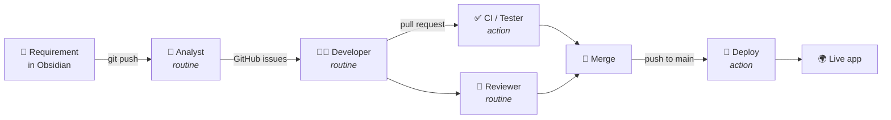

# ✦ Zenith

> **Small steps, every day.** A tiny, joyful habit tracker — and a live demo of an
> **autonomous software-delivery pipeline** powered by Claude Code.

🌍 **Live app:** https://markoub.github.io/zenith/ &nbsp;·&nbsp; 🧠 **Knowledge base:** [`/vault`](vault) (open in Obsidian)

---

## The twist: nobody writes the code

A product idea is written as a **requirement note in Obsidian**. From there, a relay of
**Claude Routines** (scheduled cloud agents) carries it all the way to a deployed feature,
with **GitHub Actions** handling the deterministic plumbing (tests + deploy):



The three AI roles are **Claude Routines** — autonomous cloud agents you can watch in the
[Routines panel](https://claude.ai/code/routines). They run hourly and on-demand:

| Stage | Runs as | What happens |
| ----- | ------- | ------------ |
| 🧭 **Analyst** | Claude Routine | Grooms a `ready` requirement into well-formed GitHub issues. |
| 👩‍💻 **Developer** | Claude Routine | Implements an issue on a branch, with tests, and opens a PR. |
| ✅ **Tester / CI** | GitHub Action ([`ci.yml`](.github/workflows/ci.yml)) | `npm test` + `npm run build` on every PR. |
| 🧐 **Reviewer** | Claude Routine | Reviews the diff, requests changes or merges once CI is green. |
| 🚀 **Deploy** | GitHub Action ([`deploy.yml`](.github/workflows/deploy.yml)) | Publishes to GitHub Pages. |

Each routine follows a versioned role brief in [`.github/agents/`](.github/agents). The full
story is in the vault: [`vault/09 - How it works/SDLC Pipeline.md`](vault/09%20-%20How%20it%20works/SDLC%20Pipeline.md).

### Start the machine
Open a requirement (e.g. [`REQ-001`](vault/02%20-%20Requirements/REQ-001%20-%20Streaks%20and%20momentum.md)),
set `status: ready`, and push. Then watch the **Actions** and **Pull requests** tabs.

---

## The app itself

Plain **Vite + TypeScript**, no framework, no backend. Domain logic lives in a pure,
fully-tested module so the agents can grow it safely.

```bash
npm install      # install
npm run dev      # local dev server
npm test         # unit tests (Vitest)
npm run build    # type-check + production build
```

```
src/habits.ts        # pure domain logic (Habit type + operations)  ← grows first
src/habits.test.ts   # unit tests                                    ← grows alongside
src/main.ts          # DOM rendering + localStorage
src/style.css        # styles
vault/               # Obsidian knowledge base — where requirements are born
.github/agents/      # the role briefs each pipeline agent follows
.github/workflows/   # the pipeline
```

See [`CLAUDE.md`](CLAUDE.md) for the conventions every agent obeys.
