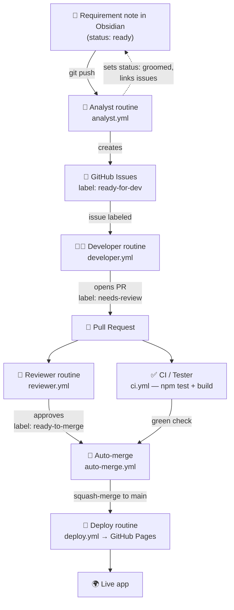

# The autonomous SDLC pipeline

This vault isn't just notes — it's the **front door of a software factory**. A requirement
written here flows, with no human writing code, all the way to a deployed feature.

## The cast (each is a GitHub Actions workflow running Claude Code)

| Stage | Workflow | Trigger | What the agent does |
| ----- | -------- | ------- | ------------------- |
| 🧭 **Analyst** | `analyst.yml` | push to `vault/02 - Requirements/**` | Reads `ready` requirements, decomposes each into 2–4 well-formed issues with acceptance criteria, labels them `ready-for-dev`, links them back into the note, sets it `groomed`. |
| 👩‍💻 **Developer** | `developer.yml` | issue labeled `ready-for-dev` | Branches, implements the feature + tests, runs the build, opens a PR (`Closes #N`), labels it `needs-review`. |
| ✅ **Tester / CI** | `ci.yml` | every pull request | `npm ci && npm test && npm run build`. The green check. |
| 🧐 **Reviewer** | `reviewer.yml` | PR opened / `needs-review` | Reviews the diff against `CLAUDE.md` standards, posts inline comments, then approves (`ready-to-merge`) or requests changes. |
| 🤝 **Merge** | `auto-merge.yml` | review approved + CI green | Squash-merges, closes the issue, deletes the branch. |
| 🚀 **Deploy** | `deploy.yml` | push to `main` | Builds and publishes to GitHub Pages. |

The detailed brief each agent follows lives in [`.github/agents/`](https://github.com/markoub/zenith)
(`analyst.md`, `developer.md`, `reviewer.md`).

## Why labels matter
Labels are the baton in this relay. Each stage only acts on a specific label and then
hands off the next one, which keeps the flow ordered and prevents agents from stepping on
each other.

## Try it
See [[Writing a requirement]] for the one move that starts the whole machine.
