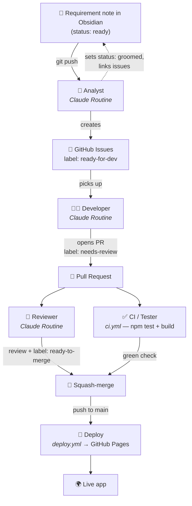

# The autonomous SDLC pipeline

This vault isn't just notes — it's the **front door of a software factory**. A requirement
written here flows, with no human writing code, all the way to a deployed feature.

## The cast

The three thinking roles are **Claude Routines** — autonomous cloud agents (watch them at
[claude.ai/code/routines](https://claude.ai/code/routines)). They run **hourly** and can be
**run on-demand** ("Run now"). The two mechanical roles are **GitHub Actions**.

| Stage | Runs as | Cadence | What the agent does |
| ----- | ------- | ------- | ------------------- |
| 🧭 **Analyst** | Claude Routine | hourly + on-demand | Reads `ready` requirements, decomposes each into 2–4 well-formed issues with acceptance criteria, labels them `ready-for-dev`, links them back into the note, sets it `groomed`. |
| 👩‍💻 **Developer** | Claude Routine | hourly + on-demand | Picks an unstarted `ready-for-dev` issue, branches, implements the feature + tests, runs the build, opens a PR (`Closes #N`), labels it `needs-review`. |
| ✅ **Tester / CI** | GitHub Action `ci.yml` | every pull request | `npm ci && npm test && npm run build`. The green check. |
| 🧐 **Reviewer** | Claude Routine | hourly + on-demand | Reviews the diff against `CLAUDE.md` standards, posts a review, then (if it passes and CI is green) labels `ready-to-merge` and squash-merges. |
| 🚀 **Deploy** | GitHub Action `deploy.yml` | push to `main` | Builds and publishes to GitHub Pages. |

> Why this split? The **judgement** work (analyse, build, review) is done by Claude Routines
> that reason about the repo. The **deterministic** work (run the test suite, ship the build)
> is done by plain CI — fast, free, and perfectly reproducible.

The detailed brief each agent follows lives in [`.github/agents/`](https://github.com/markoub/zenith)
(`analyst.md`, `developer.md`, `reviewer.md`).

## Why labels matter
Labels are the baton in this relay. Each stage only acts on a specific label and then
hands off the next one, which keeps the flow ordered and prevents agents from stepping on
each other.

## Try it
See [[Writing a requirement]] for the one move that starts the whole machine.
