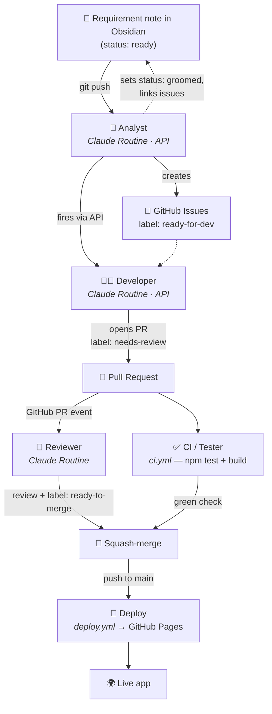

# The autonomous SDLC pipeline

This vault isn't just notes — it's the **front door of a software factory**. A requirement
written here flows, with no human writing code, all the way to a deployed feature.

## The cast

The three thinking roles are **Claude Routines** — cloud agents at
[claude.ai/code/routines](https://claude.ai/code/routines). They fire on **triggers, never on
a schedule**. The two mechanical roles are plain **GitHub Actions**.

| Stage | Runs as | Trigger | What the agent does |
| ----- | ------- | ------- | ------------------- |
| 🧭 **Analyst** | Claude Routine | **API** (`/fire`) / Run now | Reads `ready` requirements, decomposes each into well-formed issues, labels them `ready-for-dev`, links them into the note, sets it `groomed`, then fires the Developer. |
| 👩‍💻 **Developer** | Claude Routine | **API** (`/fire`) — from the Analyst | Branches, implements the feature + tests, runs the build, opens a PR (`Closes #N`), labels it `needs-review`. |
| ✅ **Tester / CI** | GitHub Action `ci.yml` | every pull request | `npm ci && npm test && npm run build`. The green check. |
| 🧐 **Reviewer** | Claude Routine | **GitHub event** `pull_request.opened` | Reviews the diff against `CLAUDE.md`, posts a review, then (if it passes and CI is green) merges. |
| 🚀 **Deploy** | GitHub Action `deploy.yml` | push to `main` | Builds and publishes to GitHub Pages. |

> **Why this shape?** Routine GitHub-event triggers support `pull_request` and `release` events
> (configured in the Routines UI, needing the Claude GitHub App). So the **Reviewer** reacts to
> PRs natively; the **Analyst → Developer** hops use the routines' **API** trigger (`/fire`).
> Nothing runs on a timer.

The detailed brief each agent follows lives in [`.github/agents/`](https://github.com/markoub/zenith)
(`analyst.md`, `developer.md`, `reviewer.md`).

## Why labels matter
Labels are the baton in this relay. Each stage only acts on a specific label and then
hands off the next one, which keeps the flow ordered and prevents agents from stepping on
each other.

## Try it
See [[Writing a requirement]] for the one move that starts the whole machine.
